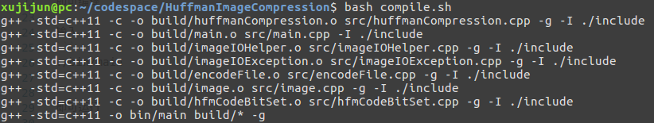

# HuffmanImageCompression

## 项目语言
C++ (std=C++11)

## 测试图片文件格式
BMP

## 输出压缩文件扩展名
.hfmc

## 测试环境
ubuntu 16.04

## 运行方式：
终端输入：

```bash
bash compile.sh
```

即可编译

输入
```
./bin/main
```

即可运行

根据提示可以完成图像压缩和解压

示例：


