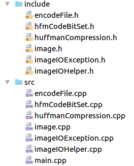
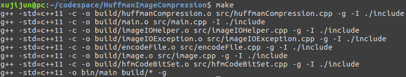
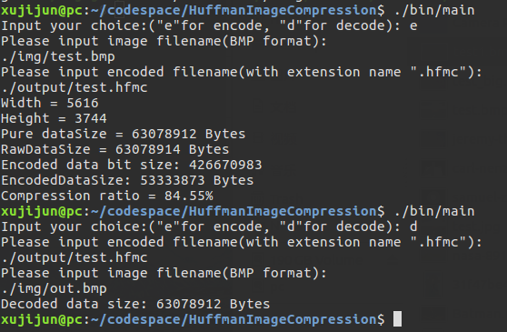
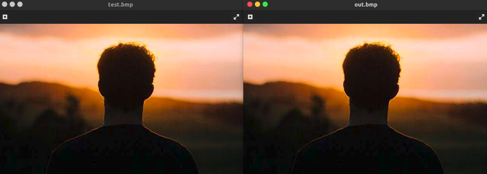
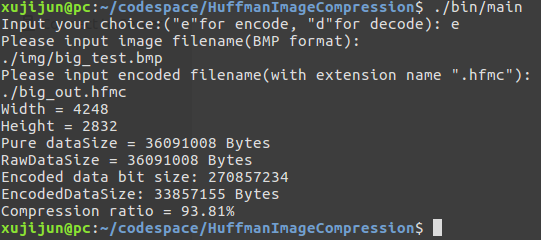

# HuffmanImageCompression

## 项目说明

### 项目语言

C++(std=C++11) 

### 编写与测试操作系统平台

ubuntu 16.04

### 文件要求

- 目前项目仅可以对BMP图像文件进行压缩。
- 压缩后的文件的扩展名为`.hfmc` ，压缩后文件结构为：
  - 原图像文件头（54字节）
  - 编码后图像数据总位数dataBitCount（4字节，即一个32为无符号整数）
  - 原图像文件中不同的数据单元的数目weightMapValCount（4字节，即一个32为无符号整数）
  - 权重映射表（表中每一项包含1个字节的原数据和4个字节即32位无符号整数表示的权重值，一共5个字节，表的总大小为weightMapValCount * 5）
  - 编码数据，实际的编码数据位数为dataBitCount，最后一个字节的数据如果是不满8位，余下的位用0作为padding

### 算法流程

- 压缩
  - 读取图像文件，每个像素包含RGB三个色彩通道，每个通道占1个字节，这是编码的单元。
  - 对读取到的每个像素的色彩通道数据进行权重统计。
  - 根据权重统计构建Huffman编码树。
  - 从Huffman编码树的根节点开始向根节点进行DFS，产生编码表。
  - 使用编码表对原来的每个通道的色彩通道数据进行编码。
  - 将编码输出到自定义的编码文件中。
- 解压缩
  - 读取自定义的编码文件，根据对编码文件结构的定义将各个部分分割出来。
  - 构造权重映射表，根据权重映射表重建Huffman编码树。
  - 读取实际编码数据，根据每个位的数据所指定的方向，从根节点开始向下游历编码树，每次到达叶子节点的时候输出叶子节点的对应数据，再重新回到根节点开始下一次游历，直到读取完编码数据。
  - 把得到的解码数据重新构建成图像格式，写入到图像文件中。

### 项目结构



在include目录包含了项目所需的各个类的定义，从上到下分别为：

- 编码文件辅助类（用于储存编码文件的相关信息）
- Huffman编码数据单元辅助类（考虑到数据量大的时候，使用字符串来保存码字会由较大的内存开销，所以创建了这个类，采用了与最后存储到文件中一样的位数据集保存形式来保存编码数据单元，也就是在Huffman编码树上的路径）
- Huffman编码操作类（算法核心）
- 图像文件辅助类（用于储存图片文件的相关信息）
- 图像IO异常类（对C++的运行时错误类的扩展，用于报出实际文件IO中详细的错误）
- 图像IO辅助类（用于进行图像和压缩后文件的读写）

### 关键代码

- 压缩：

  ```c++
  void HuffmanCompression::getEncodedData(const unsigned char *rawDataPtr, uint32_t rawDataSize, unordered_map<unsigned char, uint32_t > &dstWeightMap, unsigned char *&outputDataPtr, uint32_t &outputDataBitSize) {
      calcWeight(rawDataPtr, rawDataSize, dstWeightMap);  // 计算出权值映射表
      generateEncodedNodeQueue(dstWeightMap);  // 根据权值映射表构建编码树节点队列（使用priority_queue这样一个以堆实现的“队列”，可以保证每次进出队操作后队列的节点保持权值从小到大排列）
      buildTree();  // 建立编码树
      unordered_map<unsigned char, hfmCodeBitSet> resCodeMap;
      getCodeMap(resCodeMap);  // 根据编码树产生权值表
      outputDataBitSize = calcEncodedOutputSize(dstWeightMap, resCodeMap);  // 计算编码数据位数
      generateEncodedOutput(rawDataPtr, rawDataSize, resCodeMap, outputDataPtr, outputDataBitSize);  // 对原数据进行编码
  }
  ```

- 解压：

  ```c++
  void HuffmanCompression::getDecodedData(const unsigned char *rawDataPtr, uint32_t rawDataBitSize, const vector<pair<unsigned char, uint32_t >> &srcWeightMapArr, unsigned char *&outputDataPtr, uint32_t &outputDataSize) {
      generateDecodedNodeQueue(srcWeightMapArr);  // 根据读取文件之后构建的权值映射表构建节点队列
      buildTree();  // 建立编码树
      outputDataSize = calcDecodedOutputSize(srcWeightMapArr);  // 计算输出数据大小
      generateDecodedOutput(rawDataPtr, rawDataBitSize, outputDataPtr, outputDataSize);  // 对编码数据进行解码
  }
  ```
- 建立编码树：
  ```c++
  // 因为节点队列能够根据进出队列的节点的权值进行顺序调整，所以每次只需要从队首取出2个节点构造一棵树，将树根再次加进节点队列，直到队列只剩下一个节点，这个节点就是编码树的根节点
  void HuffmanCompression::buildTree() {
      while (nodeQueue.size() > 1) {
          TreeNode* rightNode = nodeQueue.top();
          nodeQueue.pop();
          TreeNode* leftNode = nodeQueue.top();
          nodeQueue.pop();
          auto parentNode = new TreeNode(0, rightNode -> weight + leftNode -> weight);
          parentNode -> left = leftNode;
          parentNode -> right = rightNode;
          nodeQueue.push(parentNode);
      }
      treeRoot = nodeQueue.top();
  }
  ```
- 编码表的生成：
  ```c++
  // 深度优先搜索，过程中使用path来记录路径，到达每个叶子节点的path就是叶子节点对应数据的编码
  void HuffmanCompression::dfs(TreeNode* node, hfmCodeBitSet& path,
                               unordered_map<unsigned char, hfmCodeBitSet> &resCodeMap) {
      if (node -> left == nullptr && node -> right == nullptr) {
          resCodeMap[node -> val] = path;
          return;
      }
      path.append(0);
      dfs(node -> left, path, resCodeMap);
      path.pop_back();
      path.append(1);
      dfs(node -> right, path, resCodeMap);
      path.pop_back();
  }

  // 生成编码表：调用dfs来生成编码表
  void HuffmanCompression::getCodeMap(unordered_map<unsigned char, hfmCodeBitSet> &resCodeMap) {
      if (treeRoot == nullptr)
          return;
      hfmCodeBitSet path;
      dfs(treeRoot, path, resCodeMap);
  }
  ```

## 运行方式：
终端输入：

```shell
make
```

即可编译

输入
```
./bin/main
```

即可运行

根据提示可以完成图像压缩和解压

示例：





## 测试结果

### 原始图像和压缩后恢复图像的视觉对比

  
- 可以看到，原始图像（test.bmp）和压缩后恢复图像（out.bmp）的视觉对比上没有区别。

### 评价和对比压缩率和 SNR 失真度量

- 压缩率对比

  - 对色彩较为丰富的图像，权值映射表较大，压缩效果较差。测试图片：

    

    输出：

    

    可以看到压缩前后文件大小比值为93.81% 。

  - 对色彩较为简单的图像，权值映射表较小，压缩效果较好。测试图片：

    

    输出：

    

    可以看到压缩前后文件大小比值为84.55% 。

  - 总的来说压缩前后文件大小比值范围在80～95% 。

- 信噪比和失真度量

  - 本项目采用无损Huffman编码压缩图像，可以保证压缩前后图像完全一致，图像不会失真。


## 总结

本项目没有选用matlab或者python这些编码效率较高的语言来完成，而是选用了C++，是想实际体会下如何写出一个真正好用、效率较高的压缩程序。确实过程中还有很多很多基本的压缩算法之外的问题需要思考，包括文件IO、结果保存、时间复杂度和内存占用量，还有很重要的异常处理部分。并且由于程序中涉及动态内存使用的地方很多，稍有不慎就会造成内存问题，包括很难察觉得到的内存泄漏问题，所以编写过程中借助了Valgrind这一内存分析工具对整个程序的内存使用情况进行了排查，消除了绝大部分可能存在的内存使用问题。不过在项目完成之后回顾了有关C++11的一些知识，发现其实要规避内存问题的话，可以选用智能指针，这需要在后面的学习中进一步进行实践了。